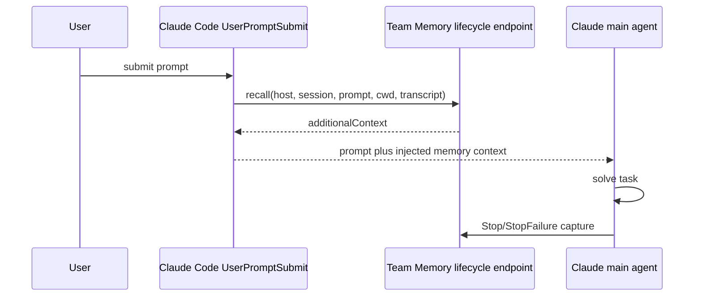
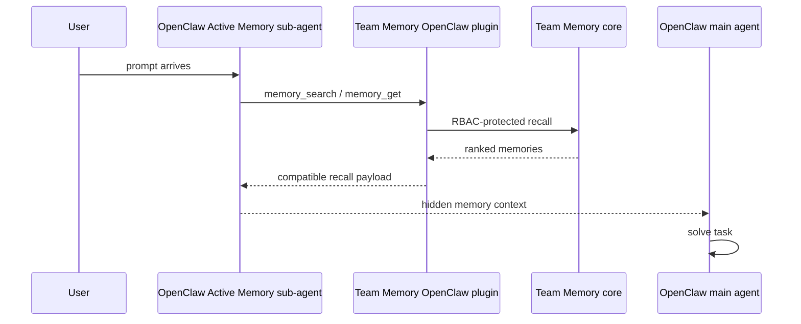
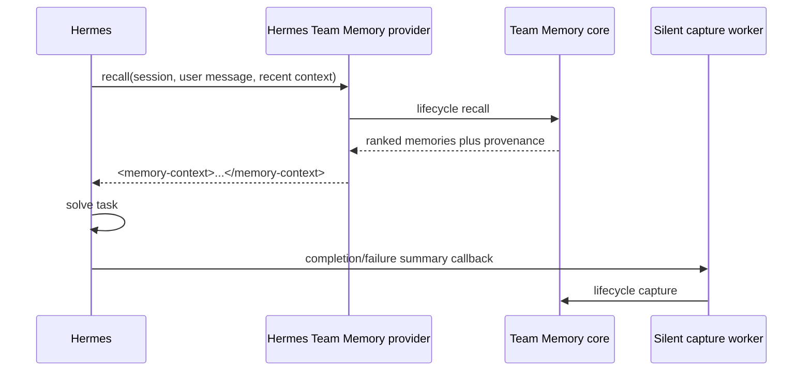

# Host memory lifecycle adapters

Status: proposed

Team Memory must support three different agent host shapes without moving
authorization, retrieval, write, history, sync, or conflict semantics out of the
TypeScript core.

The target production shape is:

- one shared Team Memory server;
- one OpenClaw client and one Hermes client;
- optionally Claude Code as a first-class lifecycle host;
- automatic recall before task execution where the host exposes a lifecycle
  seam;
- automatic success and failure capture after task execution where the host
  exposes a lifecycle seam;
- explicit tool fallback where the host only exposes tool calls.

## Interface findings

### Claude Code

Verified source: https://code.claude.com/docs/en/hooks

Claude Code exposes lifecycle hooks. The important seam is
`UserPromptSubmit`: it fires after the user submits a prompt and before Claude
processes it. Hook handlers may be shell commands, HTTP endpoints, MCP tools,
prompts, or agents. For `UserPromptSubmit`, the hook can add context to the
current turn through hook output, including JSON `additionalContext`. It cannot
replace the user's prompt.

Claude Code also exposes completion-side hooks such as `Stop`,
`SubagentStop`, `StopFailure`, and `TaskCompleted`. These are the right places
to trigger memory capture from the transcript and final run state.

Adapter consequence:

- Recall can be zero main-agent tool-call overhead by installing a
  `UserPromptSubmit` hook that calls Team Memory before Claude sees the prompt.
- Capture can be automatic by installing `Stop` and failure hooks that send the
  transcript path, session metadata, and outcome to Team Memory.
- MCP remains useful for explicit memory tools, but it is not the best primary
  lifecycle path for automatic recall.

Expected Claude Code hook flow:



Implementation target:

```json
{
  "hookSpecificOutput": {
    "hookEventName": "UserPromptSubmit",
    "additionalContext": "<team-memory-context trust=\"untrusted\">...</team-memory-context>"
  }
}
```

The exact hook registration file is owned by the consuming Claude Code project,
but the Team Memory side should expose stable HTTP endpoints for the hook:

- `POST /host/claude_code/recall`
- `POST /host/claude_code/capture`

### OpenClaw

Verified sources:

- https://docs.openclaw.ai/concepts/memory
- https://docs.openclaw.ai/concepts/active-memory

OpenClaw's native memory is workspace file-backed:

- `MEMORY.md`
- `memory/YYYY-MM-DD*.md`
- `DREAMS.md`

OpenClaw exposes memory tools such as `memory_search` and `memory_get`.
The normal tool path requires the agent, or another host-controlled agent, to
call recall tools.

OpenClaw also has an Active Memory plugin. It runs a blocking memory sub-agent
before the main assistant reply when configured. That sub-agent can use recall
tools such as `memory_search` and `memory_get`, then inject relevant memory into
the main reply context. This means OpenClaw supports two Team Memory modes:

- Tool bridge mode: preserve native OpenClaw memory and expose Team Memory as
  `team_memory.search`, `team_memory.write`, `team_memory.import_resource`,
  `team_memory.ingest_resource`, and `team_memory.read_resource`.
- Active Memory replacement mode: set `plugins.slots.memory` to the Team Memory
  plugin and expose OpenClaw-compatible `memory_search` and `memory_get` backed
  by Team Memory. The main agent does not need to decide to call Team Memory,
  but the Active Memory sub-agent still performs recall work.

Adapter consequence:

- The current `OpenClawTeamMemoryPlugin` is the right adapter boundary for tool
  bridge mode.
- For automatic recall, Team Memory should be installable as the OpenClaw memory
  slot owner and should implement the Active Memory-compatible recall contract.
- Capture should use explicit write tools unless OpenClaw provides a concrete
  run-completion or compaction hook to call Team Memory automatically.

Expected OpenClaw Active Memory replacement flow:



Example OpenClaw configuration shape:

```json
{
  "plugins": {
    "slots": {
      "memory": "team-memory-rbac"
    },
    "entries": {
      "active-memory": {
        "enabled": true,
        "config": {
          "agents": ["main"],
          "toolsAllow": ["memory_search", "memory_get"],
          "timeout": 1500
        }
      }
    }
  }
}
```

### Hermes

Verification status: host memory surface confirmed by product behavior, exact
adapter schema still needs fixture capture.

Hermes should not be modeled as having no native memory surface. Hermes provides
official memory module plugins, including provider integrations such as mem0.
The Team Memory adapter should therefore target the same host memory plugin seam
rather than treating Hermes as a generic Python tool caller.

Known Hermes memory contract:

- Hermes can call an external memory interface.
- Recalled external memory is injected into the runtime message stream wrapped
  in a distinct tag such as `<memory-context>`.
- Native Hermes memory and external memory do not overwrite each other.
- Hermes can summarize and save memory through a background silent process.
- Provider-backed modules such as mem0 define the practical adapter pattern:
  configure a memory provider, let Hermes call it during conversation lifecycle,
  and let the provider handle recall and persistence without requiring the main
  agent to choose a search/write tool.

Adapter consequence:

- Treat Hermes support as a memory-provider plugin adapter, not merely as a
  tool bridge.
- Implement Team Memory as a Hermes memory provider with the same lifecycle
  role as the official mem0-style provider.
- Do not write into Hermes native memory stores directly.
- In parallel mode, keep Hermes native memory/provider configuration and add
  Team Memory as a separate external provider namespace.
- In replacement mode, configure Team Memory as the authoritative provider for
  long-term memory and disable or avoid competing persistent providers.
- Keep Team Memory authoritative for RBAC, history, sync, conflict handling, and
  retrieval; Hermes owns only lifecycle invocation and message injection.
- Verify background/scheduler behavior explicitly. If Hermes has execution paths
  that skip memory initialization, Team Memory capture must be exercised through
  the same channel Hermes uses for official providers.

Expected Hermes flow, pending exact host schema:



The Hermes adapter cannot be considered fully verified until the official
provider interface is represented by sample artifacts in `test/fixtures/hermes/`:

- recall request payload from Hermes;
- recall response payload expected by Hermes;
- completion callback payload;
- failure callback payload;
- background/scheduler callback payload, if different.
- provider configuration example matching the official mem0-style plugin shape.

## Shared Team Memory lifecycle seam

The deep module should be host-neutral. Host adapters translate their host's
hook, provider, or tool IO into this interface. The core module owns retrieval,
formatting, authorization, path capture, conflict behavior, and persistence.

```ts
export interface HostMemoryLifecycleAdapter {
  recall(input: HostRecallInput): Promise<InjectedMemoryContext>;
  capture(input: HostCaptureInput): Promise<MemoryCaptureResult>;
}

export interface HostRecallInput {
  host: "claude_code" | "openclaw" | "hermes";
  sessionToken: string;
  sessionId: string;
  userPrompt: string;
  recentMessages?: HostMessage[];
  cwd?: string;
  resourceHints?: string[];
  tokenBudget?: number;
}

export interface InjectedMemoryContext {
  format: "plain" | "xml_tagged" | "openclaw_tool_result";
  text: string;
  memoryIds: string[];
  provenance: Array<{
    memoryId: string;
    source: "history" | "resource" | "relation";
    score: number;
  }>;
  extra?: Record<string, unknown>;
}

export interface HostCaptureInput {
  host: "claude_code" | "openclaw" | "hermes";
  sessionToken: string;
  sessionId: string;
  outcome: "success" | "failure" | "unknown";
  userPrompt?: string;
  finalAssistantMessage?: string;
  transcriptPath?: string;
  toolEvents?: HostToolEvent[];
  errorSummary?: string;
}

export interface MemoryCaptureResult {
  status: "captured";
  entityId: string;
  branchId: string;
  commitIds: string[];
  extra?: Record<string, unknown>;
}
```

Recommended HTTP facade:

- `POST /host/:host/recall`
- `POST /host/:host/capture`

The facade should call existing Team Memory primitives rather than duplicating
logic:

- recall uses `memory.search`, relation lookup, BM25/vector retrieval, resource
  chunk retrieval, and provenance formatting;
- capture writes structured conversation success or failure path memories
  through `memory.write`;
- capture uses a stable top-level result shape. Variable entity or
  entity-branch metadata is nested under `extra`, not returned as ad hoc
  top-level fields;
- capture is allowed to summarize conversation history into durable facts, merge
  semantically compatible branches, or create conflict/supersedes relations. The
  agent does not pass special `oldClaim`, `newClaim`, `intent`,
  `includeHistory`, or relationship arguments to request those outcomes;
- raw files and documents are imported through the Resource/CAS path. After CAS
  bytes and SQL/History metadata are visible, resource ingestion can run
  automatically or through an explicit ingestion command. Do not use host
  conversation capture as the file-import path;
- sync and conflict behavior remain the existing History and local pending
  overlay model.

## Lifecycle semantic extraction

Automatic lifecycle capture is a two-stage path:

1. Persist the complete host conversation as L1 Resource/ResourceChunk evidence.
2. If lifecycleExtraction is configured, call a LifecycleMemoryExtractor adapter with the complete message list, current turn, authorized memory catalog, and L1 evidence references. Validate its operations through the same memory.write interface used by Agents and commit the whole batch as one History commit.

The production HTTP adapter supports OpenAI-compatible chat completions and Ollama chat endpoints. The runtime configuration fields are provider, url, model, optional apiKey, and optional timeoutMs. Tests inject a deterministic adapter at the same seam.

No heuristic transcript-to-entity fallback is allowed. Missing configuration, timeout, invalid JSON, invalid operations, permission denial, or commit failure leaves the L1 evidence intact and records lifecycle.extraction_failed without promoting raw text.

outcome is trusted host lifecycle audit metadata. It defaults to unknown when absent, is never passed to the semantic extractor, and is not part of AgentFacingCaptureInput or memory.write.

## Security and prompt-injection rules

Injected memory is data, not instruction. Every adapter must wrap injected
memory in a trust boundary:

```xml
<team-memory-context trust="untrusted" source="team-memory-rbac">
...
</team-memory-context>
```

Adapters must not trust user-provided identity fields. They must authenticate
with a trusted session token and let the TypeScript core resolve the principal.

Capture must not blindly promote all transcript content. The lifecycle bridge
should classify:

- successful completion path;
- failed or partial completion path;
- unresolved conflict;
- user preference;
- resource-derived fact;
- operational note.

## Production readiness gaps

1. Add the host-neutral lifecycle module and HTTP facade.
2. Add a Claude Code hook adapter and fixture tests for `UserPromptSubmit`,
   `Stop`, and failure hooks.
3. Extend the OpenClaw adapter docs and tests for Active Memory replacement
   mode, including compatible `memory_search` and `memory_get` payloads.
4. Capture real Hermes provider-plugin fixtures, including the official
   mem0-style configuration and callback payloads, then implement the Team
   Memory provider adapter against those fixtures.
5. Add automatic success/failure capture policy tests. A failed path and a
   successful path for the same task should be co-retrieved on the next similar
   prompt.
6. Add lifecycle observability: host, session id, recall latency, memory ids,
   score, injected token count, capture id, and write result.
7. Add host timeout policy. Recall hooks should fail open by returning no
   memory rather than blocking the agent indefinitely.

## Decision

Use a shared Team Memory lifecycle seam with host-specific adapters:

- Claude Code uses hooks for automatic recall and capture.
- OpenClaw uses the existing tool plugin for explicit mode and an Active
  Memory-compatible plugin for automatic pre-reply recall.
- Hermes uses its official memory provider/plugin seam. Team Memory should be
  implemented as a mem0-style provider adapter, with exact payload compatibility
  locked by Hermes fixtures.

This keeps host integration shallow and keeps Team Memory deep: RBAC, history,
sync, conflict handling, retrieval quality, resource ingestion, and memory
projection remain in one place.
